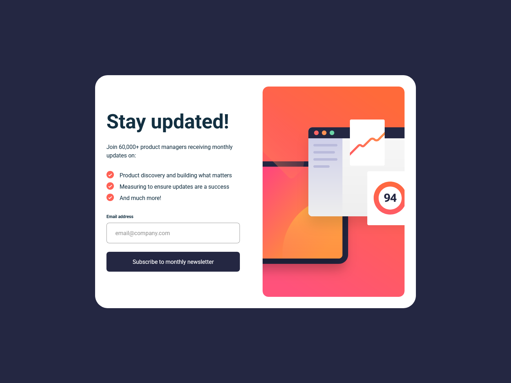

# Frontend Mentor - Newsletter sign-up form with success message solution

This is a solution to the [Newsletter sign-up form with success message challenge on Frontend Mentor](https://www.frontendmentor.io/challenges/newsletter-signup-form-with-success-message-3FC1AZbNrv). Frontend Mentor challenges help you improve your coding skills by building realistic projects. 

## Table of contents

- [Overview](#overview)
  - [The challenge](#the-challenge)
  - [Screenshot](#screenshot)
  - [Links](#links)
- [My process](#my-process)
  - [Built with](#built-with)
  - [What I learned](#what-i-learned)
  - [Continued development](#continued-development)
  - [Useful resources](#useful-resources)
- [Author](#author)

## Overview

### The challenge

Users should be able to:

- Add their email and submit the form
- See a success message with their email after successfully submitting the form
- See form validation messages if:
  - The field is left empty
  - The email address is not formatted correctly
- View the optimal layout for the interface depending on their device's screen size
- See hover and focus states for all interactive elements on the page

### Screenshot



### Links

- Solution URL: [View solution on Frontend Mentor](https://www.frontendmentor.io/solutions/)
- Live Site URL: [View Live Site](https://alexander3717.github.io/<repname>/)

## My process

### Built with

- Semantic HTML5 markup
- SASS features
- Flexbox
- CSS Grid
- Vanilla JavaScript
- Mobile-first workflow

### What I learned

At the start of this challenge I had to go back and take more time to learn flexbox better. I thought I understood it fairly well but when applying `display: flex` to `body` and `main` I encountered many problems and quickly felt like I didn't know what was going on anymore.

Because of that, I took the time to do the flexbox course and read the interactive flexbox article, which are linked in [useful resources](#useful-resources). Turns out I wasn't very familiar with how `align-items: stretch` and `flex-grow` work. After learning that (along with many other things) I was able to understand and solve the flexbox related problems I encountered before.

In the context of form validation (which was the main objective of this challenge), I learned about Constraint Validation API. It's basically a set of JavaScript objects, properties and methods which allow you to communicate with the built-in browser validation mechanisms while giving you the freedom to style the error messages etc. by yourself. For example instead of you having to write a function to check whether an email is valid, you can just use `email.validity.valid`, which the Constraint API provides.

Then a more specific thing I found out about is that you cannot use transitions on the background property. Because of that, I had to use a pseudo element workaround when wanting to transition the submit button background from dark blue to the bright gradient.

```scss
.standard-btn {
    // Button styling properties here
    //...

    transition: box-shadow 0.2s;
    position: relative;
    overflow: hidden;

    &::before { // for the gradient in active state
        content: '';
        position: absolute;
        inset: -1px;
        background: linear-gradient(90deg, #FF6A3A 0%, #FF527B 100%);
        opacity: 0;
        transition: opacity 0.2s;
    }

    span { // so the gradient doesn't cover the button text
        position: relative;
        z-index: 1;
    }

    &.ready { // class which adds the gradient and box shadow
        box-shadow: 0 rem(16px) rem(32px) 0 rgba(255, 97, 85, 0.50);

        &::before {
            opacity: 1;
        }
    }
}
```
### Useful resources

- [Flexbox course](https://flexbox.io/)
- [Flexbox article](https://www.joshwcomeau.com/css/interactive-guide-to-flexbox/) - I really liked this article. It teaches you a lot about flexbox very quickly
- [Form validation article](https://developer.mozilla.org/en-US/docs/Learn_web_development/Extensions/Forms/Form_validation) - This goes over different ways of doing client side form validation, including the Constraint API

These resources are also recommended in the Frontend Mentor learning paths.

## Author

- Frontend Mentor - [@Alexander3717](https://www.frontendmentor.io/profile/Alexander3717)